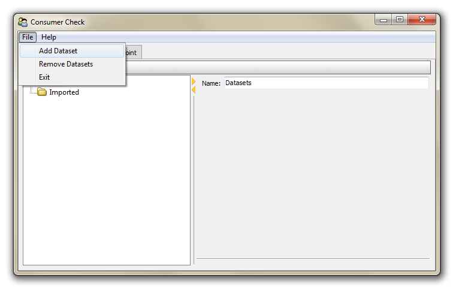
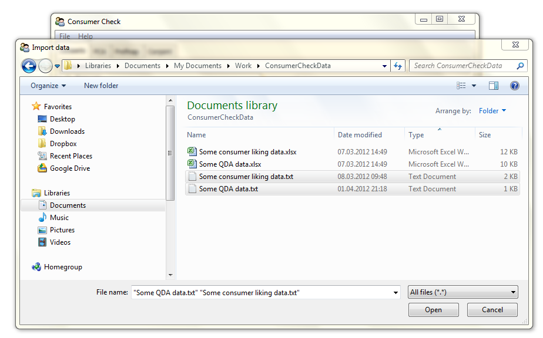
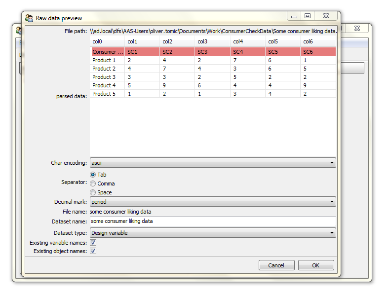

.. ConsumerCheck user manual documentation master file, created by
   sphinx-quickstart on Thu Jan 05 10:37:07 2012.
   You can adapt this file completely to your liking, but it should at least
   contain the root `toctree` directive.

.. _`Dataimport`:

===========
Data Import
===========

This chapter provides information on how to import your data into ConsumerCheck.

File types
==========
So far the following file types can be imported to ConsumerCheck:

* .txt: Text files that are **tab** delimited
* .xls: Excel files
* .xlsx: Excel 2010 files
* .csv: Comma separated value files are not supported yet (but will be in the future)

.. warning::

   So far ConsumerCheck **cannot handle special characters** (such as nordic, chinese, etc.), only plain ASCII characters. This is true for both file name and file content.
   An implementation of this feature is however on the TO DO list and will hopefully take place in the near future. 

Missing data
============
Currently import of data sets with missing data **does not work**. Handling of missing data will be implemented in the future.
If your data set contains missing data you have three options at the moment that you can carry out prior to import of the
data into ConsumerCheck:

* remove the column that has missing data
* remove row that has missing data (remember to remove the same row in all other relevant data sets)
* impute the missing value using an imputation method of your choice (for example inserting column mean or using some other more complex imputation method)

Order of samples / products / rows
==================================
For now the user has to make sure that objects are aligned across data matrices prior to analysis. An implementation that 
allows for randomised order and taking over the the job of aligning objects will be implemented later.

Import dialog
=============
Currently, the only way to import data into ConsumerCheck is by making the following selection in the main menu as seen in Fig.1:

Step 1:
-------

``File -> Add dataset``

   
   **Fig. 1: Start importing data by selecting** ``Add Dataset`` **from the File sub menu.**

Step 2:
-------
   
With the Open File dialog (Fig. 2) multiple files may be selected for import.

   
   **Fig. 2: Select one or multiple files in the Open File Dialog.**

Step 3:
-------

   
   **Fig. 3: Import File Dialog.**
