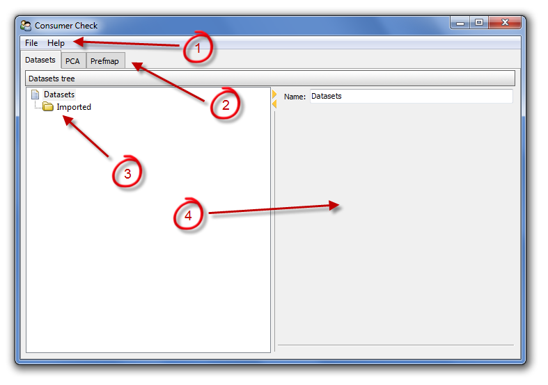

.. ConsumerCheck user manual documentation master file, created by
   sphinx-quickstart on Thu Jan 05 10:37:07 2012.
   You can adapt this file completely to your liking, but it should at least
   contain the root `toctree` directive.

==============================
Graphical User Interface (GUI)
==============================

This document discusses the main features of the GUI and their functionality behind them.

Structure of  GUI
=================
After launching ConsumerCheck the GUI will pop up. Fig. 1 shows an empty GUI with no data imported. The four main areas in the
GUI are marked with numbers. 

   
   **Fig. 1: Empty GUI prior to import of data. The numbering indicates the main structure of the GUI.**

These are the names of the main four GUI areas. Below each area is described shortly.  
 
1. **Main menu**
2. **Tabs** containing various statistical methods
3. **Tree control** for generating plots and tables
4. **Method settings area**

 
 
 
Main Menu
=========
The main menu is where all sub menus can be accessed from. The following sub menus are available:

**Sub menu: File**
------------------
The *File* sub menu contains the following selections:

- **Add dataset**

    Opens file import dialog when selected. It is possible to select multiple data files, such that all data files may be loaded in one single process. 
    More information on data import can be found in the chapter for :ref:`Dataimport`
    

- **Exit**

    Exits and closes ConsumerCheck when selected.

 

**Sub menu: Help**
------------------
The *Help* sub menu contains the following selections:

- **Help**

    Opens this documentation in your default browser.

- **About**

    Provides information about ConsumerCheck when selected. This is where you can find information on which version of ConsumerCheck is installed on your computer. 

Tabs
====
Tabs are the main tool to navigate towards places in ConsumerCheck where one can process data and apply various data analysis methods. In the current version of 
ConsumerCheck the following tabs are available each representing a specific statistical method:

- :ref:`Dataset`
- :ref:`PCA`
- :ref:`Prefmap`
- :ref:`Conjoint`

Tree Control
============
The tree control is the place where plots can be generated. After left double-clicking on any item of the tree control a new plot or table will appear 
depending on what type of information is behind the item. How many and what type of items are part of the tree control is method dependent. This means 
that the tree control changes every time when switching over toanother tab containing another statistical method.

Method Settings Area
====================
The method setting area is where parameters for each statistical method can be set. Depending on the type of the method there are different parameter options that need to be set
for analysis of the data.